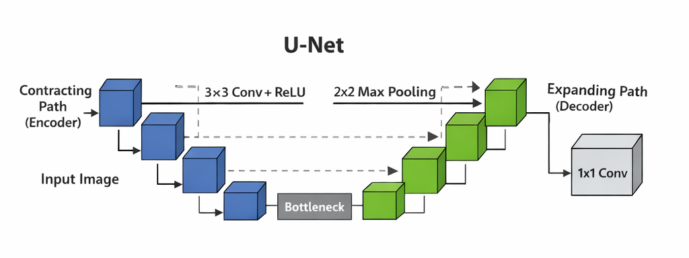
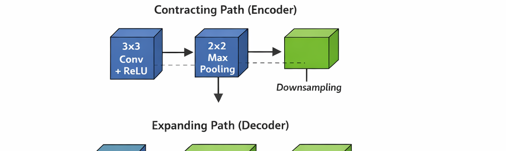
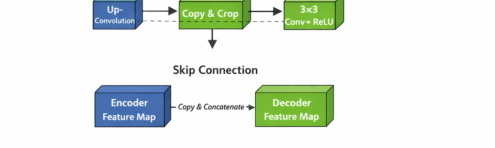
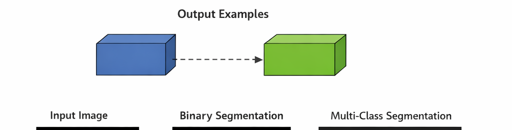
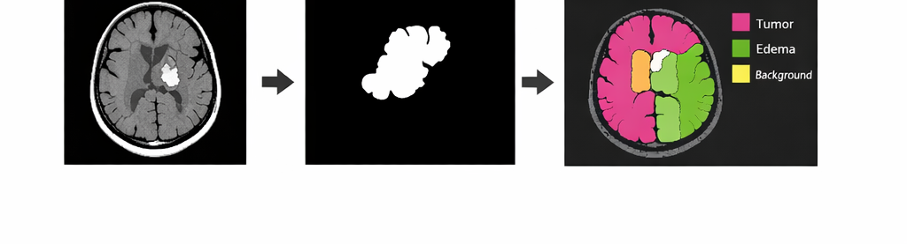

# U-Net: Convolutional Networks for Biomedical Image Segmentation  
*(Olaf Ronneberger et al., 2015)*

---

## 1. 연구 배경 (Motivation)

기존 CNN은 **이미지 분류(Classification)** 에는 강했지만  
**픽셀 단위 예측(Pixel-wise Prediction)** 이 필요한 문제에는 한계가 있었다.

### 당시 한계
- 객체 위치는 알 수 있지만 **정확한 영역 분할 불가**
- Fully Connected Layer → 공간 정보 손실
- 소량 데이터 환경에서 학습 어려움

👉 논문의 질문:
> “적은 데이터로도 **정확한 픽셀 단위 분할**을 할 수 있는 CNN은 없을까?”

---

## 2. U-Net의 핵심 아이디어

U-Net은 **Encoder–Decoder 구조**를 기반으로 한  
**Fully Convolutional Network (FCN)** 이다.

### 핵심 개념
- Downsampling으로 **문맥(Context)** 학습
- Upsampling으로 **정밀한 위치(Localization)** 복원
- Encoder feature를 Decoder로 직접 전달 (**Skip Connection**)

👉 결과:
- 적은 데이터에서도 강력한 Segmentation 성능
- 의료영상·산업영상 표준 아키텍처로 자리잡음

---

## 3. U-Net 전체 아키텍처 구조

### 구조 개요
- 왼쪽: **Contracting Path (Encoder)**
- 오른쪽: **Expanding Path (Decoder)**
- 중앙: Bottleneck

U자 형태 구조 → **U-Net**

---

## 4. Encoder (Contracting Path)

### 역할
- 이미지의 전역 문맥(Context) 추출
- 점점 더 추상적인 Feature 학습

### 구성
- 3×3 Convolution × 2
- ReLU
- 2×2 Max Pooling
- Channel 수는 단계마다 2배 증가

👉 “무엇이 있는가?”를 학습

---

## 5. Decoder (Expanding Path)

### 역할
- 해상도 복원
- 픽셀 단위 위치 정보 복구

### 구성
- Up-Convolution (Transposed Conv)
- Encoder feature와 **Concatenation**
- 3×3 Convolution × 2

👉 “어디에 있는가?”를 복원

---

## 6. 핵심 아이디어: Skip Connection

### Skip Connection의 역할
- Encoder의 **고해상도 공간 정보**를
- Decoder로 직접 전달

### 효과
- 경계(boundary) 정보 보존
- 작은 객체·정밀 영역 분할 성능 향상

👉 Segmentation 성능의 핵심 요소

---

## 7. 출력 구조 (Output Layer)

- 마지막 Layer: **1×1 Convolution**
- 각 픽셀에 대해 클래스 예측

### 출력 예시
- Binary Segmentation: (Background / Object)
- Multi-class Segmentation: Class별 Mask

---

## 8. U-Net의 주요 장점

### 장점
- ✅ 적은 데이터에서도 학습 가능
- ✅ 정밀한 경계 예측
- ✅ 구조가 단순하고 확장 용이

### 단점
- ❌ 고해상도 입력 시 메모리 사용량 큼
- ❌ 매우 복잡한 장면에서는 한계

---

## 9. U-Net의 확장 모델들

| 모델 | 특징 |
|---|---|
| U-Net | 기본 구조 |
| U-Net++ | Dense Skip Connection |
| Attention U-Net | 중요 영역에 집중 |
| 3D U-Net | 3D 의료영상 |
| nnU-Net | 자동 설정 프레임워크 |

👉 Segmentation 계열의 **ResNet 같은 존재**

---

## 10. 활용 분야

- 🧠 의료 영상 (CT, MRI, X-ray)
- 🏭 산업 결함 탐지
- 🚗 차량 파손 영역 Segmentation
- 🌍 위성/항공 이미지 분석

---

## 11. 한 문장 요약

> **U-Net은 “픽셀 단위 예측이 필요한 모든 문제의 기준이 되는 Segmentation 아키텍처”이다.**

---

## 12. 참고 링크

- U-Net 원 논문  
  https://arxiv.org/pdf/1505.04597.pdf

- U-Net++ 논문  
  https://arxiv.org/pdf/1807.10165.pdf

- nnU-Net 논문  
  https://arxiv.org/pdf/1809.10486.pdf
