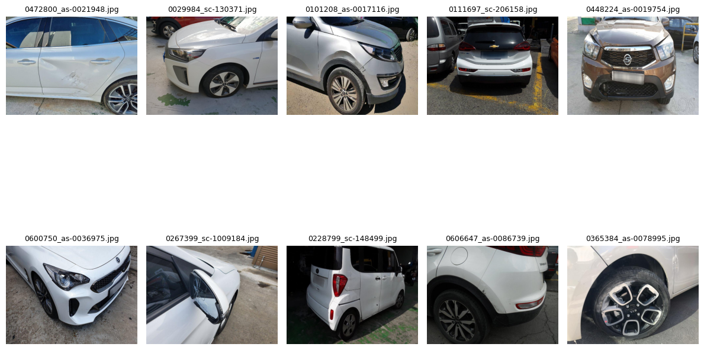
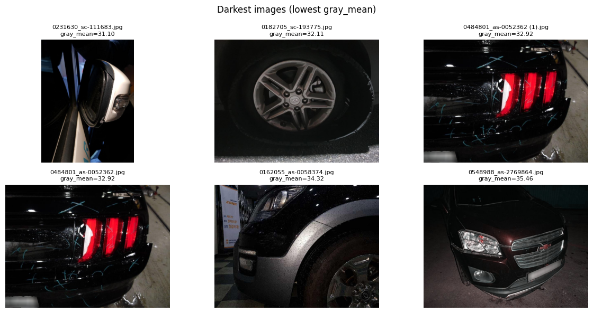
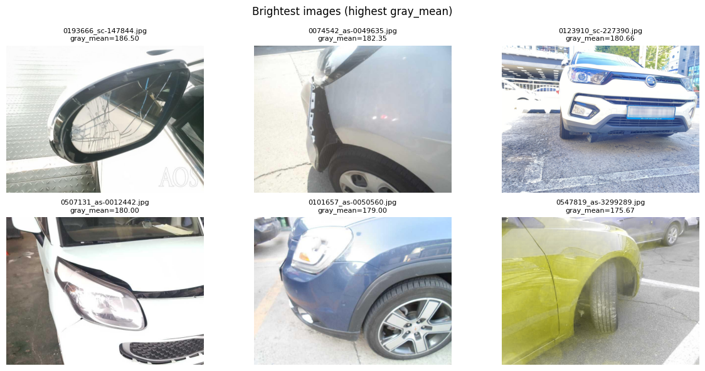
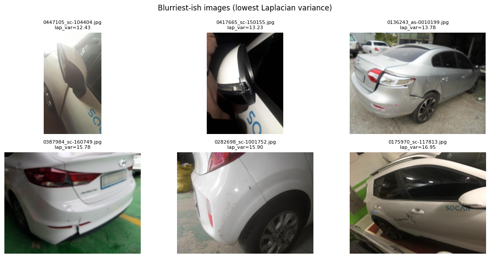
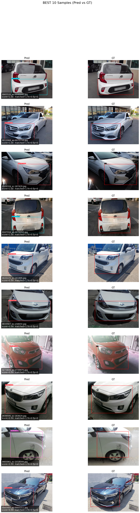
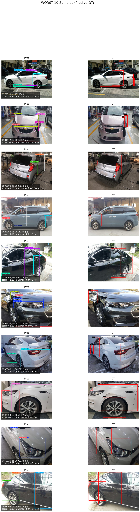

# Train Dataset Image EDA Summary

본 문서는 **모델 학습용 Train 이미지 데이터셋**에 대한 탐색적 데이터 분석(EDA) 결과를 정리한 것입니다.  
데이터 품질, 해상도 분포, 중복 여부 등을 사전에 점검하여 **학습 안정성 및 성능 저하 요인**을 최소화하는 것을 목표로 합니다.

## 1️⃣ Basic File Statistics

| 항목 | 값 |
|----|----|
| Image Folder | `/DATA/04_DATA/balanced_dataset_split/train/images` |
| Number of Images | **8,412** |
| Total Size | **1.04 GB** (1,114,622,186 bytes) |
| Avg File Size | 129.40 KB |
| Median File Size | 119.24 KB |
| Min / Max File Size | 21.85 KB / 1.24 MB |
| Image Format | `.jpg` (100%) |

---

## 2️⃣ Data Integrity Check

- **Corrupted / Unreadable Images**:  
  ✅ `0 / 8,412` (문제 없음)

---

## 3️⃣ Channel & Color Mode Distribution

### Channel Count
| Channels | Count |
|--------|------|
| 3 (RGB) | 8,411 |
| 4 (RGBA) | 1 |

> ℹ️ RGBA 이미지 1장은 전처리 시 RGB 변환 필요

### PIL Image Mode
| Mode | Count |
|----|------|
| RGB | 8,411 |
| RGBA | 1 |

---

## 4️⃣ Resolution & Aspect Ratio Statistics

### Resolution Summary

| Metric | Mean | Min | 25% | 50% | 75% | 95% | Max |
|------|------|------|------|------|------|------|------|
| Width (px) | 828.3 | 800 | 800 | 800 | 800 | 1024 | 1334 |
| Height (px) | 627.5 | 600 | 600 | 600 | 600 | 768 | 1693 |
| Megapixels | 0.53 | 0.48 | 0.48 | 0.48 | 0.48 | 0.79 | 1.64 |
| Aspect Ratio | 1.33 | 0.47 | 1.33 | 1.33 | 1.33 | 1.33 | 2.22 |

---

## 5️⃣ Most Common Resolutions (Top 10)

| Resolution | Count |
|-----------|------|
| 800 × 600 | 7,365 |
| 1024 × 768 | 340 |
| 1280 × 960 | 148 |
| 960 × 720 | 141 |
| 800 × 1067 | 110 |
| 800 × 601 | 76 |
| 1067 × 600 | 56 |
| 1280 × 720 | 45 |
| 960 × 1280 | 36 |
| 1234 × 600 | 14 |

> ✅ 전체 데이터의 대부분이 **4:3 비율 (800×600)** 로 매우 균일함

---

## 6️⃣ Brightness Distribution

- **Dark Images (gray_mean < 40)**: 8
- **Bright Images (gray_mean > 215)**: 0

> ⚠️ 극단적으로 어두운 이미지 소수 존재 → 학습 전 필터링 또는 증강 고려 가능

### 극단적인 이미지 샘플

---

## 7️⃣ RGB Pixel Statistics (Dataset-level Approx.)

- **Mean (R, G, B)**  
  → `[116.27, 115.62, 114.84]`

- **Std (R, G, B)**  
  → `[64.96, 64.67, 64.54]`

> 📌 Normalization / Standardization 시 참고 가능

---

## 8️⃣ Near-Duplicate Image Check (pHash)

- Checked Subset: **3,000 images**
- **Exact Duplicate Groups**: 9 groups  
  (각 그룹당 2장)

  **Example**
  - `0212190_as-2882313.jpg`
  - `0340781_as-3339394.jpg`

- **Approximate Duplicates** (Hamming Distance ≤ 6): 2 pairs

  **Example**
  - `d=4` → `0364174_as-3238011.jpg` ↔ `0581962_as-2926167.jpg`
  - `d=6` → `0196832_as-3161832.jpg` ↔ `0170444_as-2956297.jpg`

> ⚠️ 중복 이미지 제거 시 데이터 편향 감소 가능

---

## 9️⃣ Key Practical Insights

- ✅ 이미지 손상 없음 → 데이터 품질 양호
- ✅ 해상도 및 종횡비가 매우 균일 → Resize 비용 최소화
- ⚠️ RGBA 이미지 1장 존재 → RGB 변환 필요
- ⚠️ Near-duplicate 이미지 일부 존재 → Train set 정제 시 고려
- 📌 Dark 이미지 극소수 → Optional filtering or augmentation

---

✅ **EDA Completed**

# YOLOv8 Detection Evaluation Summary (test)

## 1) Run / Environment
- **Weight**: `/content/gdrive/MyDrive/01.DS Part/99.Study/01.Vehicle_Damage_Detection/Week_04/yolov8s/_trained_weights/parts32_20260129_035127_best.pt`
- **Ultralytics**: 8.4.8
- **Python / Torch / CUDA**: Python 3.12.12, torch 2.9.0+cu126, CUDA:0
- **GPU**: NVIDIA A100-SXM4-80GB (81222MiB)
- **Model**: 73 layers, 11,137,968 params, 28.5 GFLOPs

---

## 2) Dataset (test) Overview
- **Dataset path**: `/content/dataset_local/test`
- **Images**: 1,800
- **Instances (GT boxes)**: 2,617
- **Cache created**: `/content/dataset_local/test/labels.cache`
- **I/O**: Fast image access ✅ (read ~1511.7 MB/s, avg size ~117.3 KB)

---

## 3) Overall Metrics (All Classes)
| Metric | Value |
|---|---:|
| Precision (P) | 0.493 |
| Recall (R) | 0.476 |
| mAP@0.5 | 0.407 |
| mAP@0.5:0.95 | 0.364 |
| Fitness | 0.364 |

---

## 4) Per-Class Metrics
> Columns: **Images**(=class images), **Instances**, **P**, **R**, **mAP50**, **mAP50-95**

| Class | Images | Instances | P | R | mAP50 | mAP50-95 |
|---|---:|---:|---:|---:|---:|---:|
| all | 1800 | 2617 | 0.493 | 0.476 | 0.407 | 0.364 |
| part_0 | 175 | 175 | 0.568 | 0.709 | 0.639 | 0.577 |
| part_1 | 477 | 477 | 0.827 | 0.916 | 0.919 | 0.859 |
| part_2 | 56 | 56 | 0.407 | 0.661 | 0.474 | 0.437 |
| part_3 | 109 | 109 | 0.500 | 0.560 | 0.574 | 0.550 |
| part_4 | 36 | 36 | 0.274 | 0.278 | 0.298 | 0.252 |
| part_5 | 167 | 168 | 0.595 | 0.649 | 0.685 | 0.629 |
| part_6 | 707 | 707 | 0.848 | 0.958 | 0.930 | 0.880 |
| part_7 | 83 | 83 | 0.541 | 0.752 | 0.707 | 0.661 |
| part_8 | 16 | 16 | 0.367 | 0.544 | 0.459 | 0.454 |
| part_9 | 70 | 70 | 0.534 | 0.686 | 0.618 | 0.578 |
| part_10 | 53 | 53 | 0.459 | 0.641 | 0.513 | 0.471 |
| part_11 | 62 | 62 | 0.390 | 0.475 | 0.345 | 0.265 |
| part_12 | 114 | 114 | 0.571 | 0.712 | 0.644 | 0.541 |
| part_13 | 102 | 102 | 0.525 | 0.657 | 0.633 | 0.531 |
| part_14 | 43 | 43 | 0.303 | 0.651 | 0.431 | 0.365 |
| part_15 | 37 | 37 | 0.311 | 0.351 | 0.232 | 0.193 |
| part_16 | 32 | 32 | 0.369 | 0.625 | 0.407 | 0.351 |
| part_17 | 6 | 6 | 0.142 | 0.306 | 0.109 | 0.108 |
| part_18 | 45 | 46 | 0.409 | 0.587 | 0.507 | 0.473 |
| part_19 | 40 | 40 | 0.438 | 0.525 | 0.408 | 0.335 |
| part_20 | 68 | 68 | 0.346 | 0.529 | 0.428 | 0.372 |
| part_21 | 32 | 32 | 0.246 | 0.375 | 0.230 | 0.211 |
| part_22 | 49 | 49 | 0.422 | 0.633 | 0.413 | 0.366 |
| part_23 | 24 | 24 | 0.384 | 0.495 | 0.416 | 0.379 |
| part_24 | 3 | 3 | 0.000 | 0.000 | 0.036 | 0.022 |
| part_26 | 2 | 2 | 1.000 | 0.000 | 0.000 | 0.000 |
| part_27 | 1 | 1 | 0.000 | 0.000 | 0.142 | 0.057 |
| part_29 | 1 | 1 | 1.000 | 0.000 | 0.000 | 0.000 |
| part_30 | 1 | 1 | 1.000 | 0.000 | 0.000 | 0.000 |
| part_31 | 4 | 4 | 1.000 | 0.000 | 0.000 | 0.000 |

---

## 5) Speed (per image)
| Stage | Time |
|---|---:|
| preprocess | 0.5 ms |
| inference | 1.2 ms |
| postprocess | 0.8 ms |

---

## 6) Quick Notes
- Strong classes: **part_6**, **part_1** (high P/R and high mAP)
- Very low-sample classes (e.g., part_24/26/27/29/30/31) show unstable metrics (often R=0).
- Results saved to: `/content/runs/detect/val`

## 7) Best 10

## 7) Worst 10

