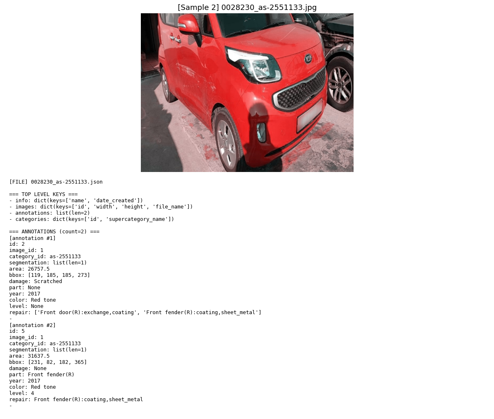
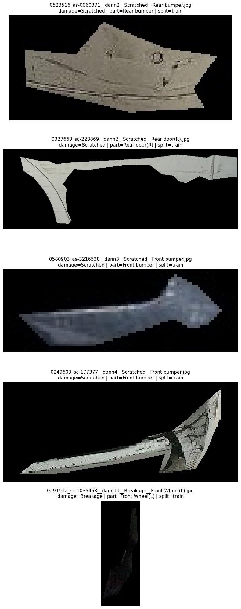

# 6주차. 차량파손종류 및 위치 판단

## 1. 데이터셋

AI_HUB 차량 파손 이미지 데이터

ㄴ VS_damage_part

- 스터디용으로 AI_HUB 데이터 중 part 정보가 포함된 데이터의 validation set 활용(17,248개)

※ 이미지 및 Label 정보 샘플


### Damage 클래스 분포

| Damage Class | Count |
|---|---:|
| Scratched | 36,664 |
| Separated | 13,095 |
| Crushed | 10,416 |
| Breakage | 9,066 |
| **Missing (part annotation only)** | 29,805 |
| **Total** | **99,046** |

---

### Part 클래스 분포

| Part Class | Count |
|---|---:|
| Front bumper | 7,310 |
| Rear bumper | 4,639 |
| Front fender(R) | 1,930 |
| Front fender(L) | 1,875 |
| Trunk lid | 1,444 |
| Bonnet | 1,434 |
| Rear fender(R) | 1,352 |
| Rear fender(L) | 1,065 |
| Rear door(R) | 1,057 |
| Head lights(R) | 978 |
| Head lights(L) | 957 |
| Front door(R) | 824 |
| Rear door(L) | 631 |
| Front door(L) | 613 |
| Rocker panel(R) | 605 |
| Rear lamp(L) | 450 |
| Front Wheel(R) | 441 |
| Rear lamp(R) | 417 |
| Side mirror(R) | 373 |
| Side mirror(L) | 339 |
| Rocker panel(L) | 302 |
| Front Wheel(L) | 284 |
| Rear Wheel(R) | 191 |
| Rear Wheel(L) | 133 |
| Rear windshield | 57 |
| Windshield | 30 |
| C pillar(R) | 16 |
| A pillar(L) | 15 |
| A pillar(R) | 12 |
| C pillar(L) | 12 |
| Undercarriage | 10 |
| Roof | 9 |
| **Missing (damage annotation only)** | 69,241 |
| **Total** | **99,046** |


# 차량 파손 분석 모델 설계 배경 및 학습 방법

## 1. 데이터 분포 분석 (EDA)

### Damage 클래스 분포

| Damage Class | Count |
|---|---:|
| Scratched | 36,664 |
| Separated | 13,095 |
| Crushed | 10,416 |
| Breakage | 9,066 |
| Missing | 29,805 |

### Part 클래스 분포

| Part Class | Count |
|---|---:|
| Front bumper | 7,310 |
| Rear bumper | 4,639 |
| Front fender(R) | 1,930 |
| Front fender(L) | 1,875 |
| Trunk lid | 1,444 |
| Bonnet | 1,434 |
| ... | ... |
| Roof | 9 |

### 데이터 특징

1. **Damage 클래스는 4개**  
2. **Part 클래스는 30+ **  
3. **데이터가 불균형**
4. **Damage만 존재하거나 Part만 존재하는 annotation이 많음**

# 2. 모델 설계 전략

위 데이터 구조를 고려하여 **2-stage 파이프라인 모델**을 설계

```
입력 이미지
      │
      ▼
YOLOv8 Segmentation
(damage 위치 + damage class)
      │
      ▼
damage 영역 crop
      │
      ▼
ResNet18 Part Classifier
(차량 부위 분류)
      │
      ▼
최종 결과
damage + part
```

---

# 3. YOLOv8 Segmentation

## 1. 파손 위치 탐지

```
차량 전체 이미지
→ 파손 위치를 찾기
```

- 파손은 **불규칙한 형태**
- bbox보다 **polygon segmentation이 정확**

 → **object detection보다 segmentation이 더 적합**


---

## 2. Damage 클래스 수가 적음

Damage 클래스

```
Scratched
Separated
Crushed
Breakage
```

이 경우

- YOLO 기반 모델이 매우 효과적
- 빠른 학습
- 높은 detection 성능

---

# 3. Part Classification 모델 분리

Part 클래스 분포를 보면 다음 특징이 있다.

```
Front bumper      7310
Rear bumper       4639
Front fender(R)   1930
...
Roof                9
```

즉

**극단적인 long-tail 분포**

---

## 문제점

YOLO segmentation으로

```
damage + part
```

을 동시에 학습하면 다음 문제가 발생

```
클래스 수 증가
→ 학습 어려움

데이터 불균형
→ rare class 성능 저하
```

---

## 해결 전략

문제를 **두 단계로 분리**

```
1단계: damage detection
2단계: part classification
```

---

# 5. Part Classification 모델

사용 모델

```
ResNet18
```

선택 이유

- 이미지 분류에 매우 안정적
- 학습 속도 빠름
- small dataset에서도 잘 동작

---

## 입력 데이터

YOLO segmentation 결과에서

```
damage mask
```

영역을 crop

예시

```
damage mask
      ↓
mask crop
      ↓
part classifier
```

※ crop 이미지 샘플




---

# 6. 학습 데이터 생성 방법

원본 annotation 구조

```
damage segmentation
part segmentation
```

하지만 둘이 **직접 연결되어 있지 않다.**

따라서 다음 방식으로 매칭하였다.

---

## IoU 기반 매칭

damage mask와 part mask의 겹침을 계산

조건

```
IoU >= 0.01
damage area inside part >= 0.5
```

조건을 만족하면

```
damage → part
```

로 매칭

---

## 결과

### IoU 기반 Damage–Part 매칭 분석

**1. 기본 통계**

| 항목 | Count |
|---|---:|
| 전체 annotation 수 | 99,046 |
| damage 값 있는 annotation 수 | 69,241 |
| part 값 있는 annotation 수 | 29,805 |
| damage + polygon annotation | 69,241 |
| part + polygon annotation | 29,805 |

- 매칭 조건 결과

| 조건 | Count |
|---|---:|
| IoU ≥ 0.01 인 damage 수 | 35,853 |
| damage_in_part_ratio ≥ 0.50 | 50,978 |
| IoU 기준 유효 이미지 수 | 14,494 |
| 포함비율 기준 유효 이미지 수 | 16,186 |

- 매칭 비율

| 기준 | 비율 |
|---|---:|
| IoU 기준 매칭 비율 | 51.78% |
| damage_in_part_ratio 기준 매칭 비율 | 73.62% |

---

**2. Damage–Part 매칭 상위 조합**

*(damage_in_part_ratio ≥ 0.50 기준)*

| Rank | Damage | Part | Count |
|---|---|---:|
| 1 | Scratched | Front bumper | 12,304 |
| 2 | Scratched | Rear bumper | 6,635 |
| 3 | Breakage | Front bumper | 2,572 |
| 4 | Separated | Front bumper | 2,407 |
| 5 | Breakage | Rear bumper | 1,453 |
| 6 | Crushed | Front bumper | 1,180 |
| 7 | Scratched | Front fender(R) | 1,125 |
| 8 | Crushed | Front fender(R) | 1,094 |
| 9 | Separated | Rear bumper | 1,088 |
| 10 | Scratched | Trunk lid | 1,086 |
| 11 | Crushed | Bonnet | 1,067 |
| 12 | Crushed | Front fender(L) | 1,066 |
| 13 | Scratched | Front fender(L) | 1,007 |
| 14 | Crushed | Trunk lid | 916 |
| 15 | Crushed | Rear bumper | 886 |
| 16 | Scratched | Rear fender(R) | 848 |
| 17 | Scratched | Rear door(R) | 772 |
| 18 | Scratched | Bonnet | 771 |
| 19 | Scratched | Rear fender(L) | 689 |
| 20 | Scratched | Front door(R) | 603 |
| 21 | Scratched | Front Wheel(R) | 588 |
| 22 | Crushed | Rear fender(R) | 452 |
| 23 | Scratched | Rear door(L) | 431 |
| 24 | Crushed | Rear fender(L) | 414 |
| 25 | Scratched | Front door(L) | 412 |
| 26 | Separated | Front fender(R) | 412 |
| 27 | Separated | Front fender(L) | 407 |
| 28 | Scratched | Front Wheel(L) | 401 |
| 29 | Breakage | Head lights(R) | 397 |
| 30 | Breakage | Head lights(L) | 379 |

---

**3. 매칭된 Part 분포**

*(damage_in_part_ratio 기준)*

| Rank | Part | Count |
|---|---|---:|
| 1 | Front bumper | 18,463 |
| 2 | Rear bumper | 10,062 |
| 3 | Front fender(R) | 2,721 |
| 4 | Front fender(L) | 2,555 |
| 5 | Trunk lid | 2,316 |
| 6 | Bonnet | 2,068 |
| 7 | Rear fender(R) | 1,538 |
| 8 | Rear fender(L) | 1,307 |
| 9 | Rear door(R) | 1,273 |
| 10 | Front door(R) | 1,032 |
| 11 | Front Wheel(R) | 913 |
| 12 | Head lights(R) | 781 |
| 13 | Front door(L) | 763 |
| 14 | Head lights(L) | 732 |
| 15 | Rear door(L) | 706 |
| 16 | Front Wheel(L) | 561 |
| 17 | Side mirror(R) | 536 |
| 18 | Rocker panel(R) | 466 |
| 19 | Side mirror(L) | 410 |
| 20 | Rear Wheel(R) | 404 |
| 21 | Rear lamp(R) | 384 |
| 22 | Rear lamp(L) | 368 |
| 23 | Rear Wheel(L) | 267 |
| 24 | Rocker panel(L) | 211 |
| 25 | Rear windshield | 62 |
| 26 | Windshield | 25 |
| 27 | C pillar(R) | 18 |
| 28 | A pillar(L) | 12 |
| 29 | Roof | 10 |
| 30 | C pillar(L) | 7 |

---

**4. 분석 요약**

[Damage–Part 관계 특징]

- **Scratched → Front bumper / Rear bumper 비율이 매우 높음**
- **Breakage → Head lights에서 많이 발생**
- **Crushed → Fender / Bonnet에서 많이 발생**

[Part 분포 특징]

- **Front bumper가 가장 많은 파손 부위**
- **Front / Rear bumper가 전체의 큰 비중 차지**
- Pillar, Roof, Windshield 등은 **극단적인 long-tail**

이 분석을 기반으로

```
damage segmentation
+
part classification
```

구조의 **2-stage 모델**을 설계

- YOLOv8 → damage 위치 + damage class
- ResNet classifier → part class

---

# 7. Inference Pipeline

추론 단계

```
Input image
      │
      ▼
YOLOv8 damage segmentation
      │
      ▼
damage mask 추출
      │
      ▼
mask 영역 crop
      │
      ▼
ResNet18 part classification
      │
      ▼
damage + part 결과 생성
```

---

# 8. 평가 방법

Prediction과 Ground Truth를

```
mask IoU ≥ 0.1
```

기준으로 매칭

평가 지표

### Detection

```
Precision
Recall
F1-score
```

### Classification

```
damage accuracy
part accuracy
joint accuracy
```

### End-to-End

```
damage + part 동시에 맞춘 비율
```

---

# 9. 이 접근 방식의 장점

## 1. 문제를 단순화

```
detection 문제
+
classification 문제
```

로 분리

---

## 2. 데이터 불균형 완화

Part 분류를 별도 모델로 처리

---

## 3. 높은 확장성

추가 클래스 발생 시

```
part classifier만 재학습
```

가능

---

# 10. 한 줄 요약

> 차량 파손 분석 문제를 **YOLOv8 기반 damage segmentation과 ResNet 기반 part classification을 결합한 2-stage 파이프라인 모델**로 해결하였다.
