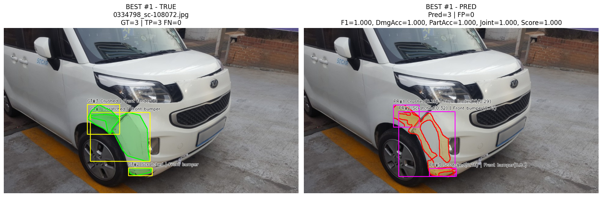

# 6주차. 차량파손종류 및 위치 판단

## 1. 데이터셋

AI_HUB 차량 파손 이미지 데이터

ㄴ VS_damage_part

- 스터디용으로 AI_HUB 데이터 중 part 정보가 포함된 데이터의 validation set 활용(17,248개)

※ 이미지 및 Label 정보 샘플


### Damage 클래스 분포

| Damage Class | Count |
|---|---:|
| Scratched | 36,664 |
| Separated | 13,095 |
| Crushed | 10,416 |
| Breakage | 9,066 |
| **Missing (part annotation only)** | 29,805 |
| **Total** | **99,046** |

---

### Part 클래스 분포

| Part Class | Count |
|---|---:|
| Front bumper | 7,310 |
| Rear bumper | 4,639 |
| Front fender(R) | 1,930 |
| Front fender(L) | 1,875 |
| Trunk lid | 1,444 |
| Bonnet | 1,434 |
| Rear fender(R) | 1,352 |
| Rear fender(L) | 1,065 |
| Rear door(R) | 1,057 |
| Head lights(R) | 978 |
| Head lights(L) | 957 |
| Front door(R) | 824 |
| Rear door(L) | 631 |
| Front door(L) | 613 |
| Rocker panel(R) | 605 |
| Rear lamp(L) | 450 |
| Front Wheel(R) | 441 |
| Rear lamp(R) | 417 |
| Side mirror(R) | 373 |
| Side mirror(L) | 339 |
| Rocker panel(L) | 302 |
| Front Wheel(L) | 284 |
| Rear Wheel(R) | 191 |
| Rear Wheel(L) | 133 |
| Rear windshield | 57 |
| Windshield | 30 |
| C pillar(R) | 16 |
| A pillar(L) | 15 |
| A pillar(R) | 12 |
| C pillar(L) | 12 |
| Undercarriage | 10 |
| Roof | 9 |
| **Missing (damage annotation only)** | 69,241 |
| **Total** | **99,046** |


## 2. 차량 파손 분석 모델 설계 배경 및 학습 방법

### 가. 데이터 분포 분석 (EDA)

- 데이터 특징

1. **Damage 클래스는 4개**  
2. **Part 클래스는 30+ **  
3. **데이터가 불균형**
4. **Damage만 존재하거나 Part만 존재하는 annotation이 많음**

## 3. 모델 설계 전략

- 위 데이터 구조를 고려하여 **2-stage 파이프라인 모델**을 설계

```
입력 이미지
      │
      ▼
YOLOv8 Segmentation
(damage 위치 + damage class)
      │
      ▼
damage 영역 crop
      │
      ▼
ResNet18 Part Classifier
(차량 부위 분류)
      │
      ▼
최종 결과
damage + part
```

---

### YOLOv8 Segmentation

**1. 파손 위치 탐지**

```
차량 전체 이미지
→ 파손 위치를 찾기
```

- 파손은 **불규칙한 형태**
- bbox보다 **polygon segmentation이 정확**

 → **object detection보다 segmentation이 더 적합**


---

**2. Damage 클래스 수가 적음**

Damage 클래스

```
Scratched
Separated
Crushed
Breakage
```

이 경우

- YOLO 기반 모델이 매우 효과적
- 빠른 학습
- 높은 detection 성능

---

**3. Part Classification 모델 분리**

Part 클래스 분포를 보면 다음 특징이 있다.

```
Front bumper      7310
Rear bumper       4639
Front fender(R)   1930
...
Roof                9
```

즉 **극단적인 long-tail 분포**

---

**문제점**

YOLO segmentation으로

```
damage + part
```

을 동시에 학습하면 다음 문제가 발생

```
클래스 수 증가
→ 학습 어려움

데이터 불균형
→ rare class 성능 저하
```

---

**해결 전략**

문제를 **두 단계로 분리**

```
1단계: damage detection
2단계: part classification
```

---

**5. Part Classification 모델**

사용 모델

```
ResNet18
```

- 이미지 분류에 매우 안정적
- 학습 속도 빠름
- small dataset에서도 잘 동작

---

**입력 데이터**

YOLO segmentation 결과에서

```
damage mask
```

영역을 crop

예시

```
damage mask
      ↓
mask crop
      ↓
part classifier
```

※ crop 이미지 샘플


---

**6. 학습 데이터 생성 방법**

원본 annotation 구조

```
damage segmentation
part segmentation
```

하지만 둘이 **직접 연결되어 있지 않다.**

따라서 다음 방식으로 매칭

---

**IoU 기반 매칭**

damage mask와 part mask의 겹침을 계산

조건

```
IoU >= 0.01
damage area inside part >= 0.5
```

조건을 만족하면

```
damage → part
```

로 매칭

---

### 결과: **IoU 기반 Damage–Part 매칭 분석**

**1. 기본 통계**

| 항목 | Count |
|---|---:|
| 전체 annotation 수 | 99,046 |
| damage 값 있는 annotation 수 | 69,241 |
| part 값 있는 annotation 수 | 29,805 |
| damage + polygon annotation | 69,241 |
| part + polygon annotation | 29,805 |

- 매칭 조건 결과

| 조건 | Count |
|---|---:|
| IoU ≥ 0.01 인 damage 수 | 35,853 |
| damage_in_part_ratio ≥ 0.50 | 50,978 |
| IoU 기준 유효 이미지 수 | 14,494 |
| 포함비율 기준 유효 이미지 수 | 16,186 |

- 매칭 비율

| 기준 | 비율 |
|---|---:|
| IoU 기준 매칭 비율 | 51.78% |
| damage_in_part_ratio 기준 매칭 비율 | 73.62% |

---

**2. Damage–Part 매칭 상위 조합**

*(damage_in_part_ratio ≥ 0.50 기준)*

| Rank | Damage | Part | Count |
|---|---|---:|
| 1 | Scratched | Front bumper | 12,304 |
| 2 | Scratched | Rear bumper | 6,635 |
| 3 | Breakage | Front bumper | 2,572 |
| 4 | Separated | Front bumper | 2,407 |
| 5 | Breakage | Rear bumper | 1,453 |
| 6 | Crushed | Front bumper | 1,180 |
| 7 | Scratched | Front fender(R) | 1,125 |
| 8 | Crushed | Front fender(R) | 1,094 |
| 9 | Separated | Rear bumper | 1,088 |
| 10 | Scratched | Trunk lid | 1,086 |
| 11 | Crushed | Bonnet | 1,067 |
| 12 | Crushed | Front fender(L) | 1,066 |
| 13 | Scratched | Front fender(L) | 1,007 |
| 14 | Crushed | Trunk lid | 916 |
| 15 | Crushed | Rear bumper | 886 |
| 16 | Scratched | Rear fender(R) | 848 |
| 17 | Scratched | Rear door(R) | 772 |
| 18 | Scratched | Bonnet | 771 |
| 19 | Scratched | Rear fender(L) | 689 |
| 20 | Scratched | Front door(R) | 603 |
| 21 | Scratched | Front Wheel(R) | 588 |
| 22 | Crushed | Rear fender(R) | 452 |
| 23 | Scratched | Rear door(L) | 431 |
| 24 | Crushed | Rear fender(L) | 414 |
| 25 | Scratched | Front door(L) | 412 |
| 26 | Separated | Front fender(R) | 412 |
| 27 | Separated | Front fender(L) | 407 |
| 28 | Scratched | Front Wheel(L) | 401 |
| 29 | Breakage | Head lights(R) | 397 |
| 30 | Breakage | Head lights(L) | 379 |

---

**3. 매칭된 Part 분포**

*(damage_in_part_ratio 기준)*

| Rank | Part | Count |
|---|---|---:|
| 1 | Front bumper | 18,463 |
| 2 | Rear bumper | 10,062 |
| 3 | Front fender(R) | 2,721 |
| 4 | Front fender(L) | 2,555 |
| 5 | Trunk lid | 2,316 |
| 6 | Bonnet | 2,068 |
| 7 | Rear fender(R) | 1,538 |
| 8 | Rear fender(L) | 1,307 |
| 9 | Rear door(R) | 1,273 |
| 10 | Front door(R) | 1,032 |
| 11 | Front Wheel(R) | 913 |
| 12 | Head lights(R) | 781 |
| 13 | Front door(L) | 763 |
| 14 | Head lights(L) | 732 |
| 15 | Rear door(L) | 706 |
| 16 | Front Wheel(L) | 561 |
| 17 | Side mirror(R) | 536 |
| 18 | Rocker panel(R) | 466 |
| 19 | Side mirror(L) | 410 |
| 20 | Rear Wheel(R) | 404 |
| 21 | Rear lamp(R) | 384 |
| 22 | Rear lamp(L) | 368 |
| 23 | Rear Wheel(L) | 267 |
| 24 | Rocker panel(L) | 211 |
| 25 | Rear windshield | 62 |
| 26 | Windshield | 25 |
| 27 | C pillar(R) | 18 |
| 28 | A pillar(L) | 12 |
| 29 | Roof | 10 |
| 30 | C pillar(L) | 7 |

---

**4. 분석 요약**

[Damage–Part 관계 특징]

- **Scratched → Front bumper / Rear bumper 비율이 매우 높음**
- **Breakage → Head lights에서 많이 발생**
- **Crushed → Fender / Bonnet에서 많이 발생**

[Part 분포 특징]

- **Front bumper가 가장 많은 파손 부위**
- **Front / Rear bumper가 전체의 큰 비중 차지**
- Pillar, Roof, Windshield 등은 **극단적인 long-tail**

이 분석을 기반으로

```
damage segmentation
+
part classification
```

구조의 **2-stage 모델**을 설계

- YOLOv8 → damage 위치 + damage class
- ResNet classifier → part class

---

## 4. Inference Pipeline

추론 단계

```
Input image
      │
      ▼
YOLOv8 damage segmentation
      │
      ▼
damage mask 추출
      │
      ▼
mask 영역 crop
      │
      ▼
ResNet18 part classification
      │
      ▼
damage + part 결과 생성
```

---

## 5. 평가

### 가. YOLOv8 Damage Segmentation Model Validation Result

**1. Model Configuration**

| 항목 | 값 |
|---|---|
| Model | YOLOv8s-seg |
| Framework | Ultralytics 8.4.21 |
| Python | 3.12.12 |
| Torch | 2.10.0 + CUDA 12.8 |
| GPU | NVIDIA A100-SXM4-80GB |
| Model Parameters | 11,781,148 |
| GFLOPs | 39.9 |

---

**2. Validation Dataset**

| 항목 | 값 |
|---|---:|
| Validation Images | 1,376 |
| Total Instances | 3,049 |
| Background Images | 0 |
| Corrupt Images | 0 |

---

**3. Overall Detection Performance**

**Bounding Box**

| Metric | Value |
|---|---:|
| Precision | 0.297 |
| Recall | 0.241 |
| mAP50 | 0.190 |
| mAP50-95 | 0.084 |

**Segmentation Mask**

| Metric | Value |
|---|---:|
| Precision | 0.251 |
| Recall | 0.202 |
| mAP50 | 0.142 |
| mAP50-95 | 0.049 |

---

**4. Class-wise Segmentation Performance**

| Damage Class | Images | Instances | Box Precision | Box Recall | Box mAP50 | Box mAP50-95 | Mask Precision | Mask Recall | Mask mAP50 | Mask mAP50-95 |
|---|---:|---:|---:|---:|---:|---:|---:|---:|---:|---:|
| Scratched | 1046 | 1569 | 0.318 | 0.349 | 0.250 | 0.114 | 0.280 | 0.296 | 0.189 | 0.061 |
| Separated | 267 | 321 | 0.237 | 0.047 | 0.064 | 0.030 | 0.170 | 0.031 | 0.036 | 0.011 |
| Crushed | 571 | 735 | 0.330 | 0.268 | 0.224 | 0.093 | 0.269 | 0.210 | 0.146 | 0.050 |
| Breakage | 369 | 424 | 0.303 | 0.300 | 0.220 | 0.099 | 0.287 | 0.271 | 0.199 | 0.074 |

---

**5. Inference Speed**

| 단계 | 시간 |
|---|---:|
| Preprocess | 0.7 ms |
| Inference | 1.3 ms |
| Postprocess | 1.4 ms |
| Total per image | 약 3.4 ms |

---

**6. Key Metrics Summary**

| Metric | Value |
|---|---:|
| Box mAP50 | **0.1896** |
| Box mAP50-95 | **0.0840** |
| Segmentation mAP50 | **0.1425** |
| Segmentation mAP50-95 | **0.0491** |

---

**7. Result Interpretation**

**Performance Characteristics**

- **Scratched 클래스 성능이 가장 안정적**
- **Separated 클래스는 recall이 매우 낮음**
- 전체적으로 **Segmentation 성능(mAP50-95 ≈ 0.05)** 은 낮은 편

**Possible Reasons**

1. Damage 영역이 매우 작은 경우 많음  
2. Damage class 간 시각적 차이가 미묘함  
3. 데이터 imbalance 존재  
4. Segmentation mask 품질 편차

---

**8. Summary**

YOLOv8s-seg 모델을 이용한 damage segmentation 결과

- **Segmentation mAP50 : 0.142**
- **Segmentation mAP50-95 : 0.049**

스터디 목적의 baseline 모델로 사용하기에는 충분하며  
이후 **데이터 증강 / class balancing / 더 큰 모델(YOLOv8m/l)** 등을 통해 성능 개선 가능하다.

### 2-Stage Part Classification Model Result (ResNet18)

**1. Model Overview**

| 항목 | 값 |
|---|---|
| Model | ResNet18 |
| Input Size | 224 × 224 |
| Task | Vehicle Part Classification |
| Training Strategy | Damage segmentation 결과를 crop 후 part classification 수행 (2-Stage pipeline) |

---

**2. Training Result**

| Metric | Value |
|---|---:|
| Train Loss | 1.6108 |
| Train Accuracy | 0.5259 |
| Validation Loss | 1.8772 |
| Validation Accuracy | **0.4337** |

**Best Model**

| 항목 | 값 |
|---|---|
| Best Epoch | 8 |
| Best Validation Accuracy | **0.4337** |
| Model Path | `/content/workdir/_runs_part_classifier/part_resnet18_study_ep8_img224/best_part_resnet18.pth` |

---

**3. Test Result**

| Metric | Value |
|---|---:|
| Test Loss | 1.9188 |
| Test Accuracy | **0.4352** |

---

**4. Per-Class Accuracy (Top Classes)**

| Part Class | Test Samples | Correct | Accuracy |
|---|---:|---:|---:|
| Front bumper | 847 | 634 | **0.7485** |
| Rear bumper | 547 | 248 | 0.4534 |
| Bonnet | 124 | 63 | 0.5081 |
| Front Wheel(R) | 58 | 35 | 0.6034 |
| Rocker panel(R) | 48 | 29 | 0.6042 |
| Head lights(L) | 67 | 29 | 0.4328 |
| Front fender(R) | 243 | 73 | 0.3004 |
| Trunk lid | 152 | 42 | 0.2763 |

---

**5. Low-Accuracy Classes**

| Part Class | Accuracy |
|---|---:|
| Rear fender(L) | 0.0306 |
| Rear Wheel(R) | 0.0385 |
| Rear door(L) | 0.0556 |
| Rocker panel(L) | 0.0000 |
| Rear Wheel(L) | 0.0000 |

---

**6. Result Interpretation**

**Overall Performance**

- **Test Accuracy ≈ 43.5%**
- Front bumper, wheels 등 **대표적인 차량 부위는 높은 정확도**
- 일부 part 클래스는 **샘플 부족으로 성능 저하**

**Observed Characteristics**

| 특징 | 설명 |
|---|---|
| Class Imbalance | Front bumper 데이터가 매우 많음 |
| Long-tail Distribution | 일부 part는 샘플이 매우 적음 |
| Visual Similarity | Fender / Door / Panel 구분이 어려움 |

---

**7. Summary**

2-Stage 파이프라인에서 **ResNet18 기반 part classifier**는

- **전체 Test Accuracy : 43.5%**
- **Front bumper 등 주요 부위는 높은 정확도**
- **Long-tail 클래스에서 성능 저하**

Baseline 모델로는 충분하며  
추후 **데이터 balancing, 더 큰 backbone, focal loss 적용** 등을 통해 성능 개선 가능

## 최종테스트(End-to-End Damage Detection Pipeline Result)

**Test Dataset**

| 항목 | 값 |
|---|---:|
| Test Images | 1,376 |
| Ground Truth Instances | 3,049 |
| Predicted Instances | 908 |

---

**1. Detection Performance**

| Metric | Value |
|---|---:|
| True Positive (TP) | 699 |
| False Positive (FP) | 209 |
| False Negative (FN) | 2,350 |
| Precision | **0.7698** |
| Recall | **0.2293** |
| F1 Score | **0.3533** |

---

**2. Matched Instance Performance**

| Metric | Value |
|---|---:|
| Matched Pair Count | 699 |
| Damage Classification Accuracy | **0.9285** |
| Part Classification Accuracy | **0.5794** |
| Joint Accuracy (Damage + Part) | **0.5451** |

---

**3. End-to-End Pipeline Performance**

| Metric | Value |
|---|---:|
| End-to-End Exact Recall | **0.1250** |

---

**4. Result Interpretation**

**Detection**

- Precision이 **0.77로 비교적 높은 수준**
- 그러나 Recall은 **0.23으로 낮음**
- 즉 **모델이 보수적으로 detection 수행**

**Damage Classification**

- Damage class 정확도 **92.8%**
- damage classification은 매우 안정적인 성능

**Part Classification**

- Part class 정확도 **57.9%**
- 차량 부위 분류는 **long-tail 문제로 성능 제한**

**End-to-End**

전체 pipeline 기준

```
Detection → Damage Classification → Part Classification
```

모든 단계가 동시에 맞는 비율

```
End-to-End Exact Recall = 12.5%
```

---

**5. Summary**

주요 결과

| 항목 | 성능 |
|---|---|
| Detection Precision | 0.77 |
| Detection Recall | 0.23 |
| Damage Accuracy | 0.93 |
| Part Accuracy | 0.58 |
| Joint Accuracy | 0.55 |
| End-to-End Recall | 0.125 |

### Best 10




### Worst 10


