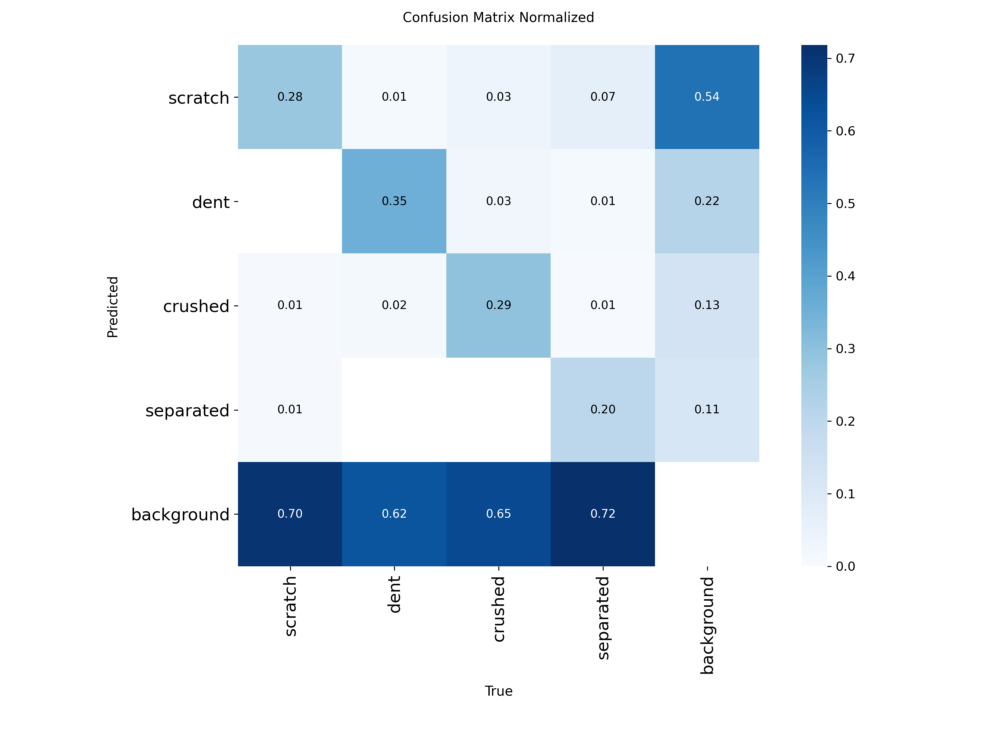
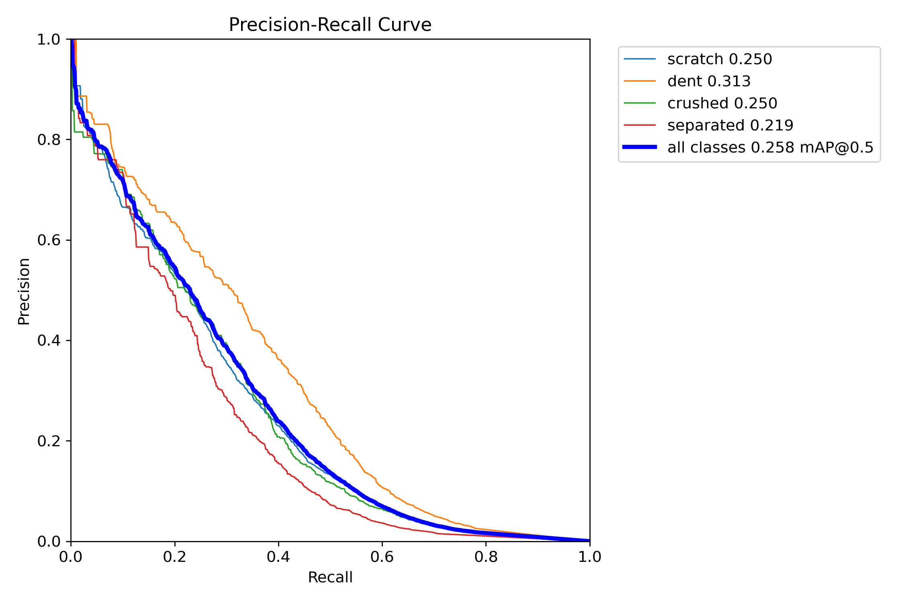
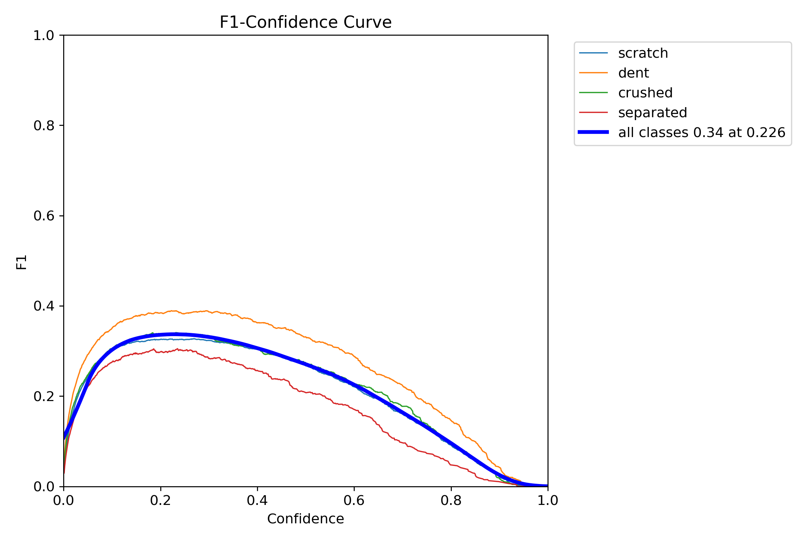
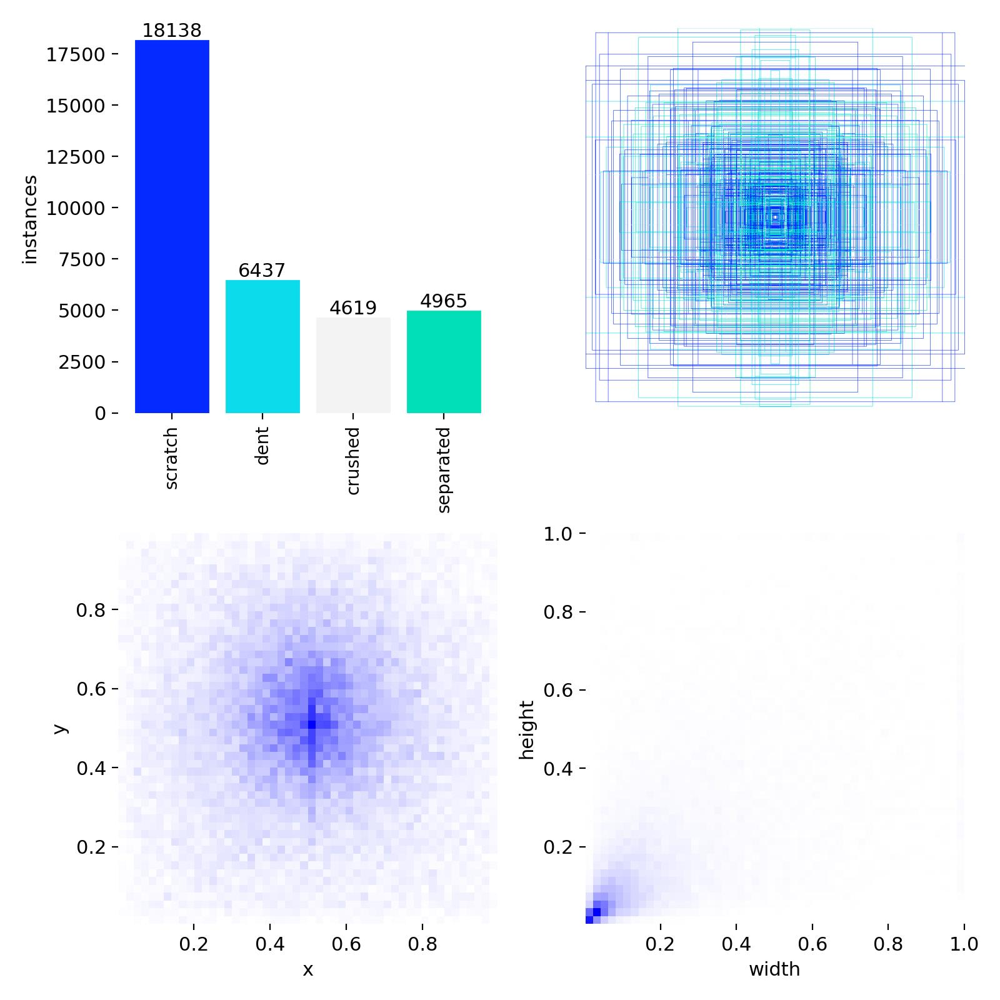
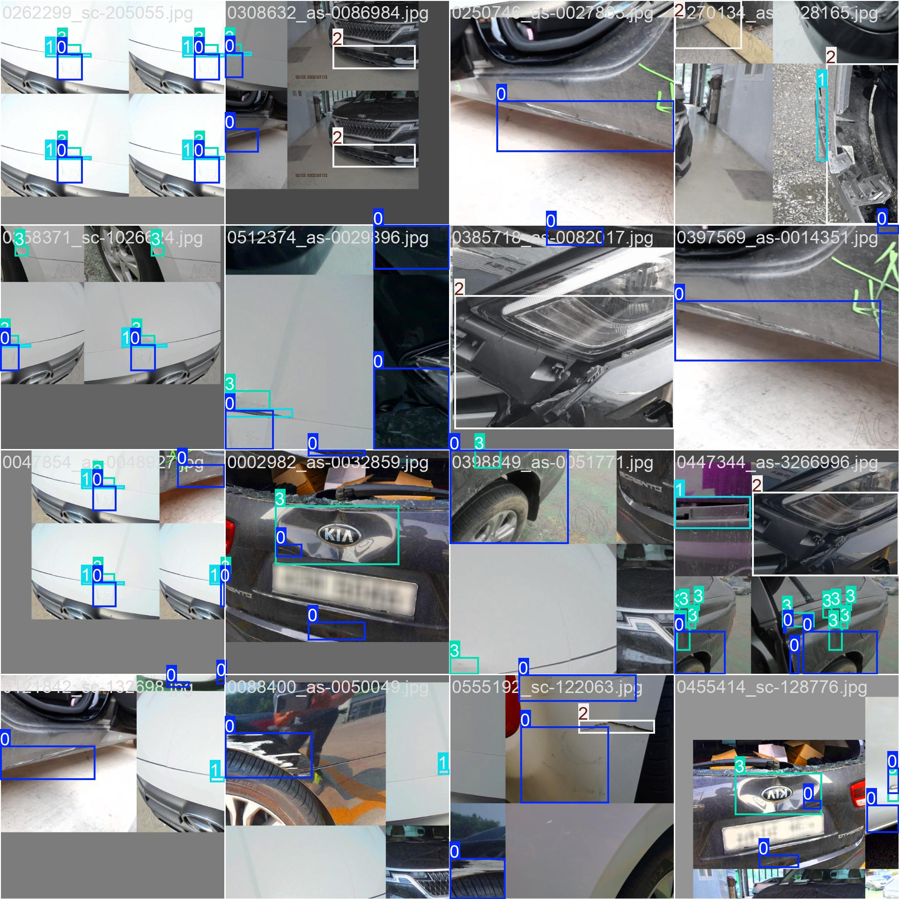

# 🚀 YOLOv8m Object Detection Training Results

이 프로젝트는 **YOLOv8m** 아키텍처를 사용하여 커스텀 데이터셋으로 객체 검출 모델을 학습한 결과입니다.

## 📊 1. 학습 요약 (Training Summary)

`results.csv` 데이터를 바탕으로 도출된 최종 에폭(72 Epoch)의 주요 성능 지표입니다.

| Metric | Value | Description |
| :--- | :--- | :--- |
| **Model** | YOLOv8m | Medium 모델 (Pre-trained) |
| **Epochs** | 72 | 학습 종료 시점 |
| **mAP50** | **0.2473** | IoU 0.5 기준 평균 정밀도 |
| **mAP50-95** | **0.1158** | IoU 0.5~0.95 기준 평균 정밀도 |
| **Precision** | 0.3941 | 정밀도 (Positive 예측의 정확도) |
| **Recall** | 0.2927 | 재현율 (실제 객체 검출 비율) |

---

## 📈 2. 학습 프로세스 시각화 (Training Progress)

학습이 진행됨에 따라 손실(Loss)이 감소하고 정확도(mAP)가 향상되는 추이를 확인할 수 있습니다.

*그림 1. 에폭별 Loss 및 주요 지표 변화 추이*

---

## 🎯 3. 모델 성능 상세 분석 (Performance Metrics)

### 🔳 혼동 행렬 (Confusion Matrix)
모델이 각 클래스를 얼마나 정확하게 분류했는지, 어떤 클래스와 혼동하고 있는지 보여줍니다.

### 📉 성능 곡선 (Precision, Recall & F1 Curve)
모델의 검출 성능과 신뢰도(Confidence) 사이의 관계를 나타내는 그래프입니다.

| Precision-Recall Curve | F1-Confidence Curve |
| :---: | :---: |
|  |  |

---

## 🖼️ 4. 데이터셋 및 학습 예시 (Dataset & Samples)

### 🏷️ 데이터 레이블 통계
학습 데이터의 클래스 분포와 바운딩 박스 크기/위치 정보입니다.

### 📸 학습 배치 샘플
모델에 입력된 실제 학습 이미지 데이터(Augmentation 적용 포함) 샘플입니다.

