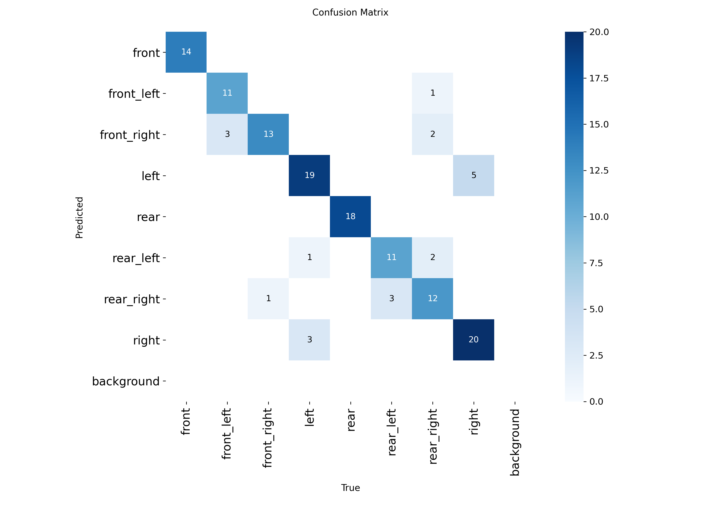
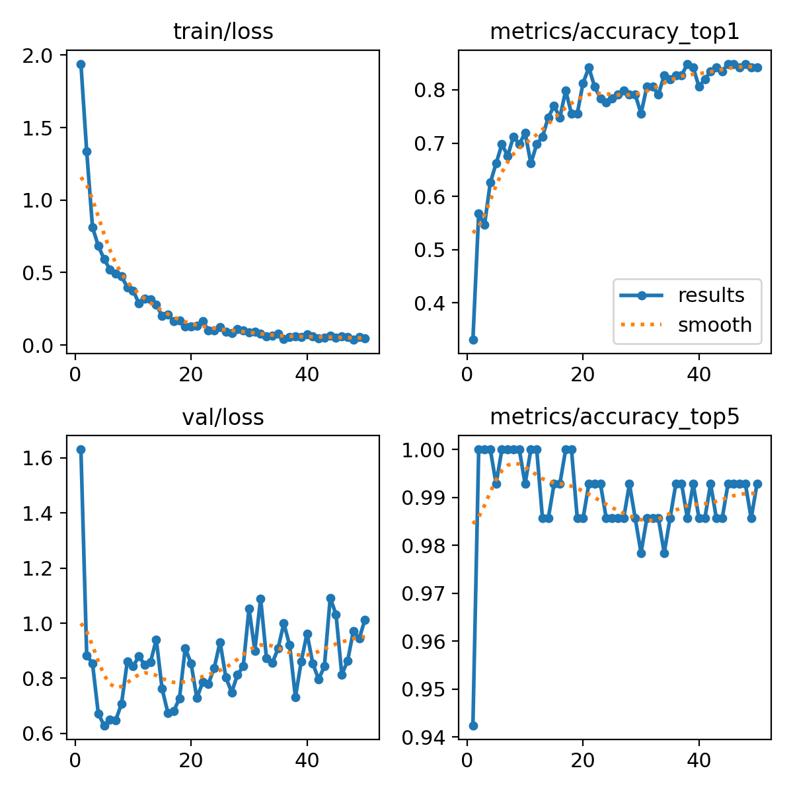

# 🚗 Vehicle 8-View Classification System
> **YOLOv8m-cls** 기반의 차량 8방향 자동 분류 시스템입니다. 자동차 보험 언더라이팅 및 사고 사진 분석 프로세스를 효율화하기 위해 개발되었습니다.

[](https://9dw2yzy8eh9gebqhybmnmy.streamlit.app/)

---

## 📌 Project Overview
차량 사진을 업로드하면 AI 모델이 차량의 방향을 8가지 클래스로 자동 분류합니다. 
* **Model:** YOLOv8m-cls (Classification)
* **Framework:** PyTorch, Ultralytics, Streamlit
* **Performance:** Top-1 Accuracy **84.9%** / Top-5 Accuracy **99.3%**

---

## 📊 Dataset Statistics
총 **690장**의 차량 이미지를 활용하였으며, 학습(Train)과 검증(Val) 데이터를 **8:2 비율**로 분할하였습니다.

| Class Name | Total Count | Train (80%) | Val (20%) | Description |
| :--- | :---: | :---: | :---: | :--- |
| **Front** | 69 | 55 | 14 | 전면 |
| **Front Left** | 70 | 56 | 14 | 전측면(좌) |
| **Front Right** | 68 | 54 | 14 | 전측면(우) |
| **Left** | 113 | 90 | 23 | 좌측면 |
| **Rear** | 90 | 72 | 18 | 후면 |
| **Rear Left** | 69 | 55 | 14 | 후측면(좌) |
| **Rear Right** | 85 | 68 | 17 | 후측면(우) |
| **Right** | 126 | 101 | 25 | 우측면 |
| **Total** | **690** | **551** | **139** | |

---

## 📈 Model Performance
학습 결과 시각화 지표입니다. (이미지 파일은 같은 폴더 내에 위치해야 함)

### 1. Confusion Matrix
전면(Front)과 후면(Rear)에서 100%의 정확도를 보이며, 대칭 구조인 측면/대각선 방향에서 일부 혼동이 발생합니다.



### 2. Training Results
50 Epoch 학습 결과, Loss가 안정적으로 수렴하며 Accuracy가 우상향하는 것을 확인할 수 있습니다.



---

## 🚀 How to Run (Demo)
1. 상단의 **[Open in Streamlit]** 버튼을 클릭하여 데모 사이트에 접속합니다.
2. 차량 사진 파일 **[test_sample]** 을 업로드합니다.
3. 모델이 예측한 방향과 신뢰도(Confidence)를 확인합니다.

---

## 📂 File Structure
```text
my-car-classifier/
├── 2026_03_11_Vehicle_8_View_Classification.ipynb  # 모델 학습 과정 및 실험 기록
├── app.py                      # Streamlit 웹 어플리케이션 구동 코드
├── best.pt                     # 학습 완료된 YOLOv8m-cls 가중치 파일 (31.7MB)
├── requirements.txt            # Python 라이브러리 의존성 (ultralytics, streamlit 등)
├── packages.txt                # Linux 시스템 의존성 (OpenCV용 libGL 등)
├── README.md                   # 프로젝트 상세 리포트 및 매뉴얼
├── result/                     # Confusion Matrix, Loss Curve 등 학습 결과 이미지
└── test_sample/                # 데모 시연 및 테스트를 위한 샘플 차량 이미지
